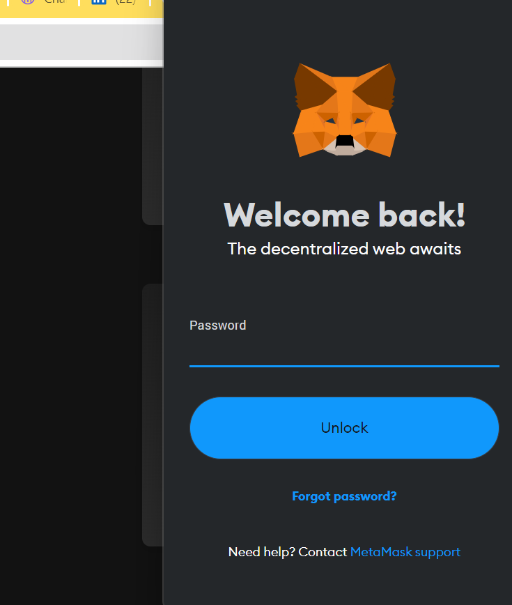

# Crypto Trading Platform

Welcome to the Crypto Trading Platform repository!

## Description

This is a simple crypto trading platform built using React.

## Snapshots

  

  

  

## Installation and Setup Instructions

Clone down this repository. You will need `node.js` and `git` installed globally on your machine.

1. Installation: `npm install`

2. In the project directory, you can run: `npm start`
